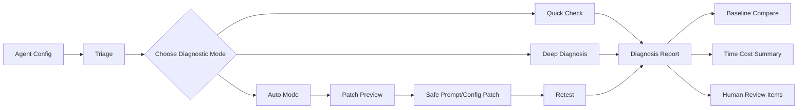

# AgentDoctor

A lightweight diagnostic toolkit for LLM agents.

AgentDoctor helps developers triage, test, diagnose, compare, and repair LLM agents through pre-diagnosis planning, quick checks, deep multi-round diagnosis, automatic repair loops, structured failure classification, baseline comparison, configuration snapshots, patch previews, and time-cost reports.

Status: early development. Interfaces may evolve, but the core diagnostic workflow is usable.

[](https://github.com/shiki-dml/AgentDoctor/actions/workflows/docs.yml)

The current Python distribution is `agenttracedoctor`, the import package is `contract2agent`, and both `agentdoctor` and `c2a` are installed as CLI entry points. Use `agentdoctor` for the current documentation; `c2a` remains available for compatibility with the original contract-to-agent trace tools.

## Quick Navigation

| Area | What it does | Start here |
|---|---|---|
| Triage | Pre-diagnose an agent and recommend a test plan | [Guide](docs/triage.md) |
| Quick Check | Run a fast single-round key behavior diagnosis | [Guide](docs/quick.md) |
| Deep Diagnosis | Run multi-round detailed diagnosis with review policies | [Guide](docs/deep.md) |
| Auto Mode | Diagnose, patch, and retest toward target confidence | [Guide](docs/auto.md) |
| Failure Taxonomy | Classify failures into structured categories | [Guide](docs/failure-taxonomy.md) |
| Baselines | Save and compare diagnostic baselines | [Guide](docs/baselines.md) |
| Config Snapshots | Save prompt/config state with baselines | [Guide](docs/configuration.md) |
| Patch Preview | Inspect proposed prompt/config changes before applying | [Guide](docs/patch-preview.md) |
| Time Cost | Track runtime and efficiency of diagnostic runs | [Guide](docs/time-cost.md) |
| Reports | Understand generated Markdown/JSON reports | [Guide](docs/reports.md) |
| Examples | Explore sample agents and sample reports | [Examples](examples/) |

## What AgentDoctor Does

AgentDoctor is not only an eval runner. It is a diagnostic workflow that combines static intake, deterministic trace checks, tool-call inspection, scoring, structured failure classification, baselines, patch previews, time-cost summaries, and human review. The goal is to answer practical agent questions: what kind of agent is being tested, which behaviors matter first, why a failure happened, whether a prompt/config change caused a regression, and whether a proposed repair is safe enough to review or apply.

## Workflow Diagram



## Trace-Based Diagnosis

Final-output-only evals can miss where an agent failed. AgentDoctor keeps the
intermediate trace visible: tool-call order, forbidden tools, tool errors,
side effects after failed reads, required output sections, checker behavior,
monitor behavior, parser coverage, prompt gaps, and eval expectations.

Given a contract and traces, AgentDoctor helps answer what went wrong, which
part of the system is responsible, whether a rule is too loose or too strict,
whether checker or monitor logic missed a violation, and what concrete change
should be reviewed next.

## Diagnosis Issue Protocol

`c2a diagnose`, `c2a check-all --diagnose`, and `c2a why` use a stable
`DiagnosisIssue` protocol. Each issue includes severity, category, strictness,
affected agent part, summary, natural-language cause, machine-readable
evidence, deterministic confidence, likely location, responsibility, suggested
fix, structured patch shape, and suggested regression trace when available.

The stable diagnosis enums live in `contract2agent.diagnosis_schema`:

- `DiagnosisCategory`
- `Strictness`
- `Severity`
- `AffectedAgentPart`

Diagnosis reports include total issue counts, counts by category, counts by
affected agent part, structured issues, and a rule coverage matrix. Markdown
and YAML reports render the same stable fields for review and automation.

## Quick Start

AgentDoctor is not currently documented as a published package. Install it from a local checkout:

```bash
git clone https://github.com/shiki-dml/AgentDoctor.git
cd AgentDoctor
pip install -e .
```

Run the main workflow with the implemented CLI syntax:

```bash
agentdoctor triage --agent ./agent.yaml
agentdoctor quick
agentdoctor deep --rounds 3 --review on-fail
agentdoctor auto --target-confidence 0.85 --max-rounds 6 --review on-fail
agentdoctor deep --rounds 3 --save-baseline
agentdoctor deep --rounds 3 --compare-baseline
```

Patch preview is currently a separate preview-only command:

```bash
agentdoctor patch-preview --from-run reports/latest.json
```

Static time/cost estimation is also available:

```bash
agentdoctor triage --include-cost
agentdoctor cost-estimate --from-triage .agentdoctor/triage/latest.json
```

## Diagnostic Modes

### Triage

Triage inspects agent configuration, prompts, tool descriptions, eval metadata, baselines, and safe patch readiness before formal testing. Use it first when you need an intake plan, risk level, key behaviors to test, missing information, and a recommended next command.

Example:

```bash
agentdoctor triage --agent ./agent.yaml
```

Docs: [Triage](docs/triage.md)

### Quick

Quick is a fast single-round smoke diagnosis over the highest-priority behavior checks. It is incomplete by design and should be used during development or before a deeper run, not as certification that the agent is correct.

Example:

```bash
agentdoctor quick
```

Docs: [Quick Check](docs/quick.md)

### Deep

Deep is multi-round diagnosis with review policies, traces, tool calls, scores, failure taxonomy, review items, and report aggregation. It does not modify the agent.

Example:

```bash
agentdoctor deep --rounds 3 --review on-fail
```

Docs: [Deep Diagnosis](docs/deep.md)

### Auto

Auto runs diagnosis and limited safe repair loops against allowlisted prompt/config files until target confidence, max rounds, max time, max patches, low improvement, or review gates stop the run. Diagnostic confidence is heuristic, not a guarantee.

Example:

```bash
agentdoctor auto --target-confidence 0.85 --max-rounds 6 --review on-fail
```

Docs: [Auto Mode](docs/auto.md)

## Core Features

### Failure Taxonomy

Failure taxonomy turns raw failures into structured classes such as
`TOOL_MISSING`, `TOOL_ORDER_ERROR`, `OUTPUT_SCHEMA_ERROR`,
`HALLUCINATION_RISK`, and `SAFETY_RISK`. It matters because auto repair, patch
preview, baseline comparison, and human-readable reports need to know what
class of failure occurred and what kind of fix is appropriate.

The stable failure type labels are `CONFIG_ERROR`, `TASK_INCOMPLETE`,
`TOOL_MISSING`, `TOOL_ORDER_ERROR`, `TOOL_ARGUMENT_ERROR`,
`FORBIDDEN_TOOL_CALL`, `OUTPUT_FORMAT_ERROR`, `OUTPUT_SCHEMA_ERROR`,
`ERROR_HANDLING_MISSING`, `HALLUCINATION_RISK`, `LOOP_RISK`,
`LOW_STABILITY`, `REGRESSION`, `SAFETY_RISK`, `SCORER_UNCERTAIN`, and
`UNKNOWN`. Severity is tracked separately as `info`, `warning`, `error`, or
`critical`, so the same failure type can have different operational impact in
different contexts.

Quick, deep, and auto runs produce findings with trace and scorer evidence.
Triage can also surface potential risks before tests have run. Patch previews
and auto mode use these failure types to choose fix strategies, validation tags,
human-review gates, and rollback-oriented baseline checks.

Docs: [Failure Taxonomy](docs/failure-taxonomy.md)

### Baselines

Baselines save a diagnostic state so future runs can answer whether confidence, tests, failure types, prompts, tool descriptions, or eval metadata improved or regressed.

Docs: [Baselines](docs/baselines.md)

### Config Snapshots

Configuration snapshots are saved with baselines. They include safe prompt/config files, hashes, command metadata, git state when available, and exclusions for secrets and credentials.

Docs: [Configuration](docs/configuration.md)

### Patch Preview

Patch preview produces human-reviewable patch proposals from findings. It explains the reason, related failure types, files that would change, diff, risk, approval requirement, expected effect, and rollback plan. In v0.1, `agentdoctor patch-preview` is preview-only.

Docs: [Patch Preview](docs/patch-preview.md)

### Time Cost

Time-cost reporting includes measured per-test durations in diagnostic JSON, auto-mode elapsed/budget summaries, and the static `agentdoctor cost-estimate` pre-run estimator for runtime, test count, tool-call, and review burden planning.

Docs: [Time Cost](docs/time-cost.md)

## Example Report Preview

```text
AgentDoctor Deep Diagnosis

Status: NEEDS_REVIEW
Diagnostic confidence: 0.78
Rounds executed: 3
Failures: 4
Warnings: 2

Top failure types:
1. TOOL_ORDER_ERROR
2. OUTPUT_SCHEMA_ERROR
3. ERROR_HANDLING_MISSING

Baseline comparison:
Confidence: 0.82 -> 0.78 (-0.04)

Time cost:
Total runtime: 4m 32s
Slowest test: missing_file_recovery

Recommendation:
Review tool-call order and output schema before enabling auto mode.
```

See [examples/reports/](examples/reports/) for sample quick, deep, and auto reports. The sample reports are examples, not actual run outputs from this checkout.

## Repository Layout

```text
.
|-- README.md
|-- pyproject.toml
|-- mkdocs.yml
|-- contract2agent/
|   |-- cli.py
|   |-- diagnostic_modes.py
|   |-- failure_taxonomy.py
|   |-- baseline.py
|   |-- triage/
|   |-- patch_preview/
|   |-- cost_estimate/
|   `-- templates/
|-- docs/
|   |-- index.md
|   |-- getting-started.md
|   |-- cli.md
|   |-- triage.md
|   |-- quick.md
|   |-- deep.md
|   |-- auto.md
|   |-- failure-taxonomy.md
|   |-- baselines.md
|   |-- configuration.md
|   |-- patch-preview.md
|   |-- time-cost.md
|   |-- reports.md
|   |-- examples.md
|   `-- development.md
|-- examples/
|   |-- README.md
|   |-- paper-reader-agent/
|   `-- reports/
|-- scripts/
|   `-- check_docs_links.py
|-- tests/
`-- .github/
    `-- workflows/
        `-- docs.yml
```

## Design Principles

- Human-reviewable diagnosis
- Trace-aware testing
- Structured failure classification
- Safe patch previews
- Reproducible baselines
- Explicit time-cost reporting
- Conservative automatic repair

## Documentation

- [Documentation home](docs/index.md)
- [Getting started](docs/getting-started.md)
- [CLI reference](docs/cli.md)
- [Configuration](docs/configuration.md)
- [Reports](docs/reports.md)
- [Examples](docs/examples.md)

## Project Focus

| Area | Focus |
|---|---|
| Core diagnosis | triage, quick, deep, and report generation |
| Repair workflow | auto mode, patch preview, safe prompt/config changes |
| Regression workflow | baselines, snapshots, and comparison reports |
| Efficiency workflow | time-cost summaries and budget warnings |
| Developer workflow | examples, documentation site, and CI-friendly usage |

## License

No license file is currently included in this repository.
