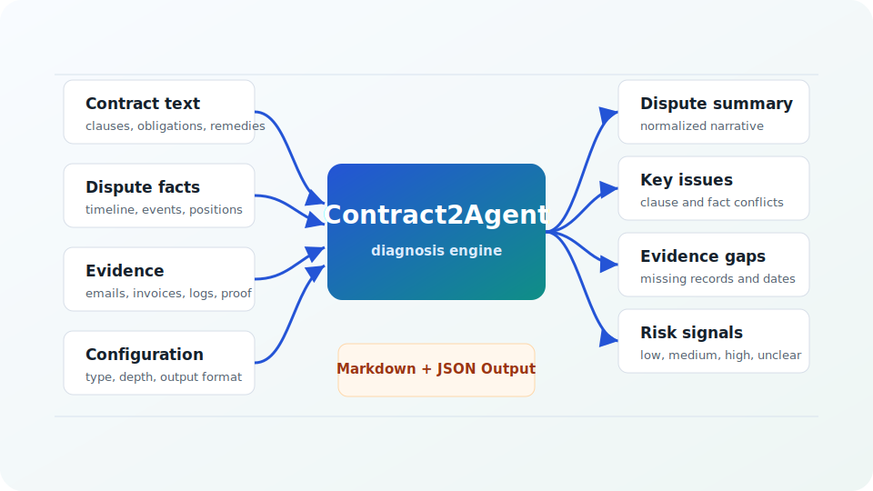
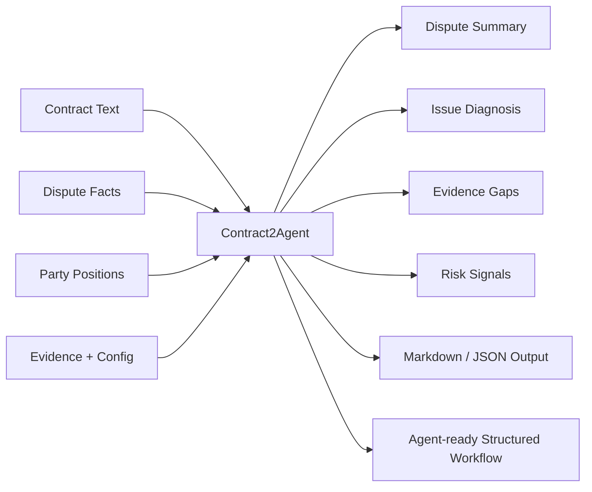

# Contract2Agent

Turn contract disputes into structured diagnostic reports and agent-ready workflows.

[](https://www.python.org/)
[](#testing)
[](https://shiki-dml.github.io/Contract2Agent/playground/)
[](#cli-usage)
[](#roadmap)

**Contract2Agent** is a developer-oriented contract dispute diagnosis and structured workflow tool. It helps transform contract text, dispute facts, party positions, evidence, and configuration into reviewable outputs: dispute summaries, key issues, clause signals, evidence gaps, risk signals, suggested next steps, and Markdown/JSON-style reports.

**Start here:** [Open Web Demo](https://shiki-dml.github.io/Contract2Agent/playground/) | [Quickstart](#cli-quickstart) | [CLI Usage](#cli-usage) | [Examples](#concrete-example-service-payment-dispute) | [Testing](#testing) | [GitHub Pages Setup](#github-pages-setup)

## Try the GitHub Pages Demo

The fastest way to experience Contract2Agent is the public GitHub Pages demo:

**[https://shiki-dml.github.io/Contract2Agent/playground/](https://shiki-dml.github.io/Contract2Agent/playground/)**

The public demo is deployed from `docs/playground.md` through GitHub Pages.

For local preview without deployment, run MkDocs from your cloned repository and open the Playground page:

```text
python -m mkdocs serve
```

The static demo is served directly from `docs/`. It lets users enter contract text, dispute facts, claimant and respondent positions, evidence, desired outcome, and configuration such as contract type, dispute type, output format, diagnosis depth, and risk mode.

After analysis, the page shows structured diagnosis results: a dispute summary, detected contract/dispute type, key issues, relevant clauses or clause signals, a claimant/respondent matrix, evidence gaps, risk signal, suggested next steps, a Markdown-style report preview, JSON-style output, and an Evaluation Lab with a generated test-case preview.

## Preview



## Why Contract2Agent?

Contract disputes are messy because obligations, facts, deadlines, notices, positions, and evidence are scattered across contract language, emails, invoices, logs, messages, and local assumptions. Contract2Agent gives developers a deterministic way to organize that material into a structured diagnostic format that can be inspected, exported, tested, and used in agent workflows.

It is not trying to be a legal decision maker. It is a workflow layer for making the problem clearer: what is being claimed, what clauses might matter, what evidence is present, what is missing, and what the next structured review step should be.

## What The GitHub Pages Demo Does

### Capture Inputs

The demo accepts the core material that usually defines a contract dispute: contract text, dispute description, claimant position, respondent position, evidence, desired outcome, contract type, dispute type, diagnosis depth, risk mode, output preference, and optional metadata.

### Diagnose The Dispute

Browser-side deterministic rules look for signals such as payment, invoice, refund, delivery, milestone, acceptance, termination, written notice, cure period, liability, damages, force majeure, confidentiality, uptime, SLA, suspension, and evidence terms.

### Surface Clause Signals

The output highlights likely clause families such as payment timing, disputed-invoice language, acceptance criteria, delivery deadlines, cure periods, suspension rights, SLA credits, limitation terms, and remedy language.

### Identify Evidence Gaps

The demo calls out missing records such as signed agreements, invoice dates, payment records, written notices, cure-period timelines, delivery confirmations, acceptance criteria, damages calculations, and respondent objection records.

### Export Structured Output

Results can be copied as Markdown, JSON-style output, or a test-case-like JSON preview, making the demo useful for report drafts, fixtures, product demos, and agent workflow experiments. The page includes Copy Markdown, Copy JSON, and Copy Test Case JSON actions.

## Evaluation-first design

Contract2Agent is built around reproducible diagnosis rather than one-off narrative output.

- `python -m pytest` protects Python behavior, schemas, checker logic, reports, CLI commands, docs links, and the GitHub Pages static site.
- Golden tests protect stable diagnosis fields such as category, strictness, affected agent part, cause substrings, suggested patch type, and regression trace shape.
- CLI smoke tests protect real commands such as `c2a demo`, `c2a check-all --diagnose`, `c2a diagnose`, and `c2a why`.
- Report rendering tests protect Markdown reports and JSON-serializable structured output.
- GitHub Pages static tests protect `docs/playground.md`, relative assets, no-backend behavior, copy actions, privacy/disclaimer text, and the Evaluation Lab.

The web Evaluation Lab shows how structured inputs become quality signals: Input Completeness, Evidence Coverage, Detected Issues, Clause Signals, Risk Signal, export readiness, and a Generated Test Case Preview. It mirrors the repository testing mindset, but it does not run pytest in the browser.

## Concrete Example: Service Payment Dispute

**Contract clause**

> "The client must pay all undisputed invoices within 30 days. The provider may suspend service after written notice and a 10-day cure period."

**Dispute**

> "The client has not paid two invoices. The provider suspended access after sending one email notice. The client argues the invoices were disputed."

**Example output**

- Key issue: whether invoices were undisputed
- Relevant clause: payment and cure period
- Evidence gap: proof of written notice date and dispute notice
- Risk signal: medium / unclear
- Suggested next step: build a timeline of invoice, dispute, notice, cure period, and suspension dates

```json
{
  "case_type": "service_payment_dispute",
  "risk_signal": "medium",
  "key_issues": ["invoice dispute status", "notice and cure period", "suspension timing"],
  "evidence_gaps": ["date of written notice", "proof invoices were undisputed"],
  "suggested_next_steps": ["build payment timeline", "attach invoice and notice evidence"]
}
```

## Workflow



## CLI Quickstart

The GitHub Pages demo is for fast visual exploration. The `c2a` CLI is for local, reproducible, testable diagnosis workflows and report generation.

```bash
git clone <repo-url>
cd <repo-name>
python -m pip install -e ".[dev]"
```

Create and diagnose the built-in local demo project:

```bash
c2a demo --out demo_project
c2a counterexamples demo_project/agent_contract.yaml --out demo_project/traces/counterexamples
c2a check-all --contract demo_project/agent_contract.yaml --traces demo_project/traces/counterexamples --diagnose
```

## CLI Usage

These commands exist in the current package entry point:

```bash
c2a --help
c2a diagnose --help
c2a check-all --diagnose
c2a why --help
c2a demo
c2a check
c2a check-all
```

Useful report-oriented commands:

```bash
c2a diagnose --contract ./agent_contract.yaml --traces ./traces --out ./reports/diagnosis.md
c2a why --contract ./agent_contract.yaml --trace ./traces/example.json --out ./reports/why.md
c2a check --contract ./agent_contract.yaml --trace ./traces/example.json
```

Package identity:

- Python distribution: `contract2agent`
- Python import package: `contract2agent`
- CLI: `c2a`

## Project Layout

```text
.
|-- contract2agent/        # Python package
|-- docs/                  # GitHub Pages site and MkDocs documentation
|   |-- playground.md      # Static Pages demo entry point
|   |-- assets/            # CSS, JS, and SVG preview asset
|   |-- examples/          # Static demo sample cases
|   `-- audits/            # Preserved audit notes
|-- examples/              # Repository examples
|-- scripts/               # Maintenance scripts
|-- tests/                 # pytest test suite
|-- pyproject.toml         # Packaging and optional extras
`-- README.md
```

## GitHub Pages Setup

The public site lives in `docs/` and is designed to deploy without npm, a backend, API keys, paid services, or a build step.

1. Open the repository settings on GitHub.
2. Go to **Pages**.
3. Set **Source** to **Deploy from a branch**.
4. Set **Branch** to `main`.
5. Set **Folder** to `/docs`.
6. Save and wait for GitHub Pages to publish.
7. Open **[https://shiki-dml.github.io/Contract2Agent/playground/](https://shiki-dml.github.io/Contract2Agent/playground/)**.
8. Set the repository **Website** field to the GitHub Pages URL so the demo is visible from the repository sidebar.

GitHub Pages readiness checklist:

- `docs/playground.md` exists and is the demo entry page.
- CSS, JavaScript, image, and example references use relative paths.
- `docs/assets/styles.css`, `docs/assets/app.js`, and `docs/assets/contract2agent-preview.svg` exist when referenced.
- No backend, build step, API key, LLM API, or dev server is required.
- GitHub Pages source should be set to the target branch and `/docs`.
- Repository Website should point to `https://shiki-dml.github.io/Contract2Agent/playground/`.

## Testing

Install development dependencies and run the test suite:

```bash
python -m pip install -e ".[dev]"
python -m pytest
```

The test suite includes schema tests, deterministic diagnosis logic tests, golden fixture checks, rule coverage checks, Markdown report rendering tests, CLI smoke tests, packaging/dev dependency checks, README/docs integrity checks, and GitHub Pages static tests.

Golden fixtures live under `tests/fixtures/golden/`. They intentionally compare compact expected fields and substrings instead of brittle full-report snapshots.

For documentation checks:

```bash
python -m pip install -e ".[docs]"
python scripts/check_docs_links.py
python -m mkdocs build --strict
```

## Disclaimer

Contract2Agent is a developer tool and structured analysis demo. It is not legal advice. The GitHub Pages demo output is preliminary and should be reviewed by qualified professionals before legal decisions are made.

## Roadmap

- Richer GitHub Pages playground interactions
- More dispute templates and sample cases
- Better clause detection and evidence-gap heuristics
- Improved structured diagnosis schema
- Markdown and JSON export polish
- More static report previews
- GitHub Pages documentation refinements
- More golden tests
- CLI polish

## Contributing

Pull requests should keep the project deterministic, lightweight, and easy to run locally.

- Run `python -m pytest` before opening PRs.
- Keep behavior deterministic and testable.
- Avoid unnecessary external APIs and paid services.
- Keep the GitHub Pages site static, lightweight, and deployable from `docs/`.
- Keep docs and CLI behavior aligned.
- Do not commit caches, virtual environments, generated reports, runtime data, or local junk.

## License

No license file is currently included in this repository.
