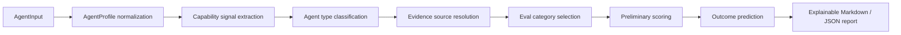

# Contract2Agent

[English](./README.md) | [中文](./README.zh-CN.md)

Pre-runtime AI agent evaluation and outcome prediction for agent profiles, tool surfaces, permissions, sample tasks, and available evidence.

[](https://www.python.org/)
[](#testing)
[](https://shiki-dml.github.io/Contract2Agent/agent-eval/)
[](#cli-usage)
[](#limitations)

**Start here:** [Project Purpose](#project-purpose) | [Evaluation-First Design](#evaluation-first-design) | [Static Demo](#static-demo) | [CLI Usage](#cli-usage) | [Testing](#testing)

## Project Purpose

Contract2Agent answers a narrow pre-runtime question:

> Given an agent description, tool surface, permissions, sample tasks, and available evidence, what broad type of agent is it, what capabilities appear supported, what risks are visible, what evidence exists, and what cautious outcome can be predicted before deployment or iteration?

It is not a universal arbitrary-agent judge. It does not say an agent is good because of its name, branding, or self-description. It classifies broad agent types, selects applicable eval categories, records missing evidence, and explains why confidence is low or high.

## Evaluation-First Design

Blind agent judgment is unsafe because declared capability is cheap and performance evidence is expensive. Contract2Agent separates:

Evaluation-first design keeps those evidence levels separate instead of collapsing them into a blind label.

- `Declared capability`: what the description or user says.
- `Inferred capability`: what tools, permissions, sample tasks, and policy constraints imply.
- `Observed evidence`: experiment summaries, traces, logs, tests, or imported results linked to the agent.
- `Reference evidence`: benchmark or methodology references used to design eval categories.
- `Prediction`: a cautious estimate based on evidence strength, type fit, risk, and missing evidence.
- `Missing evidence`: what must be collected before a stronger claim is justified.

The framework reports preliminary score dimensions such as capability fit, evidence strength, tool risk, autonomy risk, task clarity, approval safety, data-access risk, expected reliability, and missing-evidence penalty. It avoids one opaque score.

## Architecture



Core Python modules live under `contract2agent/evaluation/`:

- `schema.py`: JSON-serializable dataclasses for profiles, tools, signals, evidence, scores, predictions, and reports.
- `capability_classifier.py` / `classifier.py`: broad multi-label type classification from non-name signals.
- `registry.py`: broad agent type and eval category registries.
- `evidence.py`: local evidence and source-reference resolution.
- `scoring.py`: preliminary evidence-aware score dimensions.
- `prediction.py`: cautious outcome estimates.
- `reports.py` / `report.py`: Markdown and JSON report rendering.

## Supported Broad Agent Types

- `coding_agent`
- `file_reading_agent`
- `browser_navigation_agent`
- `contract_review_agent`
- `research_agent`
- `workflow_automation_agent`
- `financial_transaction_agent_simulated`
- `general_tool_use_agent`
- `unknown_agent`

Financial transaction agents are simulation-only. Contract2Agent does not support real payment, trade, ordering, transfer, or external financial execution.

## Static Demo

The GitHub Pages agent evaluation demo is static, browser-only, and bilingual:

- Local page: [docs/agent-eval/index.html](docs/agent-eval/index.html)
- Public route: `https://shiki-dml.github.io/Contract2Agent/agent-eval/`
- Assets: [docs/assets/agent-eval.js](docs/assets/agent-eval.js), [docs/assets/agent-eval.css](docs/assets/agent-eval.css)
- Static data: [docs/data/agent_eval/source_references.json](docs/data/agent_eval/source_references.json)
- Language switch: English / 中文, persisted locally in the browser.

The demo lets users enter:

- agent name and description
- declared capabilities
- tools and tool permissions
- file, code, browser, network, transaction, and external-state flags
- autonomy and approval settings
- sample tasks and policy constraints
- optional pasted experiment summary

It returns classified agent type(s), inferred capabilities, matched signals, risk flags, applicable eval categories, preliminary scorecard, outcome prediction, evidence basis, source references, missing evidence, recommended next tests, JSON export, and Markdown export.

The demo has no backend. It does not run real experiments, call APIs, use API keys, execute code, submit forms, fetch live benchmark data, or perform real financial actions.

## Legacy Contract Playground

The original static contract-dispute playground remains available at [docs/playground/index.html](docs/playground/index.html). It is now best understood as a legacy specialized demo and future `contract_review_agent` eval-pack example, not the main project identity.

The legacy Evaluation Lab still demonstrates deterministic browser-side report generation, Copy Markdown, Copy JSON, and Copy Test Case JSON behavior. Existing Golden tests and GitHub Pages static tests preserve this route.

Preview:


## Evidence And Sources

Static source metadata is local and contextual. References include:

- OpenAI agent evaluation methodology for traces, graders, datasets, and eval runs.
- SWE-bench as a coding-agent evaluation reference for real GitHub issue tasks and failing-to-passing test signals.
- WebArena as a browser-agent evaluation reference for realistic self-hostable web tasks.

Benchmark references do not create direct scores. A user-entered agent receives benchmark-backed performance credit only if an actual comparable `ExperimentSummary` or imported trace is linked to that agent.

## CLI Usage

Existing local diagnosis commands remain available:

```bash
c2a --help
c2a demo
c2a check
c2a check-all --diagnose
c2a diagnose --help
c2a why --help
c2a capabilities
```

Agent evaluation command:

```bash
c2a eval-agent \
  --profile examples/agent_eval/coding_agent_profile.json \
  --results examples/agent_eval/sample_experiment_results.json \
  --benchmarks examples/agent_eval/benchmark_references.json \
  --out reports/agent_eval.md
```

Package identity:

- Python distribution: `contract2agent`
- Python import package: `contract2agent`
- CLI: `c2a`

## Python Usage

```python
from contract2agent.evaluation import (
    ReportRenderer,
    evaluate_agent_profile,
    load_agent_profile,
    load_experiment_results,
)

profile = load_agent_profile("examples/agent_eval/coding_agent_profile.json")
results = load_experiment_results("examples/agent_eval/sample_experiment_results.json")
evidence, scorecard, prediction = evaluate_agent_profile(profile, results)

markdown = ReportRenderer().render_markdown(profile, evidence, scorecard, prediction)
```

## Project Layout

```text
.
|-- contract2agent/
|   |-- evaluation/              # Generalized agent evaluation framework
|   |-- cost_estimate/
|   |-- patch_preview/
|   `-- triage/
|-- docs/
|   |-- agent-eval/              # Static generalized agent evaluation demo
|   |-- data/agent_eval/         # Static source/category/profile metadata
|   `-- playground/              # Legacy contract-review playground
|-- examples/agent_eval/         # Small sample profiles, summaries, sources
|-- scripts/
|-- tests/
|-- pyproject.toml
|-- README.md
`-- README.zh-CN.md
```

## Testing

Install development dependencies and run:

```bash
python -m pip install -e ".[dev]"
python -m pytest
python -m compileall -q contract2agent tests scripts
```

When documentation dependencies are installed:

```bash
python -m pip install -e ".[docs]"
python scripts/check_docs_links.py
python -m mkdocs build --strict
```

The test suite covers schema serialization, classification invariants, anti-overfitting, evidence-source handling, benchmark-reference discipline, report rendering, Golden tests, CLI smoke tests, docs integrity, GitHub Pages static tests, and the legacy Evaluation Lab.

## Limitations

- Contract2Agent performs preliminary evaluation, not deep category-specific grading.
- Declared capability is weak evidence.
- Tool and task inference is not proof of performance.
- Benchmark references are contextual unless actual experiment results exist.
- Outcome predictions are estimates, not guarantees.
- GitHub Pages remains static and does not run arbitrary agent experiments.
- Financial transaction evaluation is simulated-only.

## Roadmap

- Add richer observed trace import and validation.
- Expand broad eval categories into specialized eval packs only after the core schema stabilizes.
- Add deterministic graders for selected categories.
- Keep source references local and contextual.
- Preserve legacy contract-review functionality as a specialized adapter path.

## Disclaimer

Contract2Agent is an experimental developer framework for structured agent evaluation and diagnosis. It is not legal advice, financial advice, or a guarantee of agent behavior. Reports should be reviewed by qualified humans before deployment or operational decisions.

## Contributing

- Run `python -m pytest` before opening PRs.
- Keep behavior deterministic and testable.
- Do not fabricate benchmark or experiment evidence.
- Keep README.md and README.zh-CN.md structurally aligned.
- Keep GitHub Pages static and backend-free.
- Do not commit caches, virtual environments, generated reports, runtime data, or local junk.

## License

No license file is currently included in this repository.
