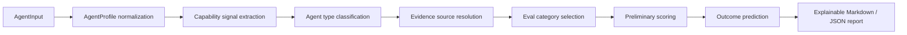

# Contract2Agent

[English](./README.md) | [中文](./README.zh-CN.md)

Contract2Agent 是一个预运行 AI 智能体评估与结果预测框架，面向智能体画像、工具表面、权限、示例任务和已有证据。

[](https://www.python.org/)
[](#测试)
[](https://shiki-dml.github.io/Contract2Agent/agent-eval/)
[](#cli-用法)
[](#限制)

**快速入口：** [项目目的](#项目目的) | [评估优先设计](#评估优先设计) | [静态演示](#静态演示) | [CLI 用法](#cli-用法) | [测试](#测试)

## 项目目的

Contract2Agent 回答一个明确的预运行问题：

> 给定智能体描述、工具表面、权限、示例任务和已有证据后，它大致属于哪类智能体，哪些能力看起来有依据，哪些风险可见，当前证据是什么，以及在部署或迭代前可以做出怎样谨慎的结果预测？

它不是任意智能体的通用裁判。它不会因为智能体名称、品牌或自我描述就判断“表现良好”。它会分类广义智能体类型，选择适用的评估类别，记录缺失证据，并解释置信度为什么高或低。

## 评估优先设计

盲目判断智能体是不安全的，因为声明能力很容易，性能证据却很昂贵。Contract2Agent 明确区分：

评估优先设计会保留这些证据层级，而不是把它们压成一个粗糙标签。

- `Declared capability`：描述或用户声明的能力。
- `Inferred capability`：工具、权限、示例任务和策略约束所暗示的能力。
- `Observed evidence`：与该智能体关联的实验摘要、轨迹、日志、测试或导入结果。
- `Reference evidence`：用于设计评估类别的基准或方法论引用。
- `Prediction`：基于证据强度、类型匹配、风险和缺失证据的谨慎估计。
- `Missing evidence`：在提出更强结论前必须补充的证据。

框架会报告能力匹配度、证据强度、工具风险、自主性风险、任务清晰度、审批安全性、数据访问风险、预期可靠性和缺失证据惩罚等初步评分维度，避免使用一个不透明总分。

## 架构



核心 Python 模块位于 `contract2agent/evaluation/`：

- `schema.py`：用于画像、工具、信号、证据、分数、预测和报告的 JSON 可序列化 dataclasses。
- `capability_classifier.py` / `classifier.py`：基于非名称信号的广义多标签类型分类。
- `registry.py`：广义智能体类型与评估类别注册表。
- `evidence.py`：本地证据与来源引用解析。
- `scoring.py`：证据感知的初步评分维度。
- `prediction.py`：谨慎的结果估计。
- `reports.py` / `report.py`：Markdown 与 JSON 报告渲染。

## 支持的广义智能体类型

- `coding_agent`
- `file_reading_agent`
- `browser_navigation_agent`
- `contract_review_agent`
- `research_agent`
- `workflow_automation_agent`
- `financial_transaction_agent_simulated`
- `general_tool_use_agent`
- `unknown_agent`

金融交易智能体仅限模拟评估。Contract2Agent 不支持真实付款、交易、下单、转账或外部金融执行。

## 静态演示

GitHub Pages 智能体评估演示是静态、纯浏览器且双语的：

- 本地页面：[docs/agent-eval/index.html](docs/agent-eval/index.html)
- 公开路由：`https://shiki-dml.github.io/Contract2Agent/agent-eval/`
- 资源文件：[docs/assets/agent-eval.js](docs/assets/agent-eval.js)、[docs/assets/agent-eval.css](docs/assets/agent-eval.css)
- 静态数据：[docs/data/agent_eval/source_references.json](docs/data/agent_eval/source_references.json)
- 语言切换：English / 中文，选择会保存在浏览器本地。

演示允许用户输入：

- 智能体名称和描述
- 声明能力
- 工具和工具权限
- 文件、代码、浏览器、网络、交易和外部状态标记
- 自主程度和审批设置
- 示例任务和策略约束
- 可选的粘贴实验摘要

它会返回智能体类型分类、推断能力、匹配信号、风险标记、适用评估类别、初步评分卡、结果预测、证据依据、来源引用、缺失证据、建议的下一步测试、JSON 导出和 Markdown 导出。

演示没有后端。它不会运行真实实验、调用 API、使用 API key、执行代码、提交表单、抓取实时基准数据或执行真实金融操作。

## 旧版合同 Playground

原始的静态合同争议 playground 仍可在 [docs/playground/index.html](docs/playground/index.html) 使用。它现在更适合作为旧版专项演示，以及未来 `contract_review_agent` 评估包示例，而不是项目的主要身份。

旧版 Evaluation Lab 仍展示确定性的浏览器端报告生成、Copy Markdown、Copy JSON 和 Copy Test Case JSON 行为。现有 Golden tests 与 GitHub Pages 静态测试会保留这一路由。

预览：


## 证据与来源

静态来源元数据保存在本地，并且只作为上下文。引用包括：

- OpenAI agent evaluation methodology：用于轨迹、评分器、数据集和 eval runs 的方法论上下文。
- SWE-bench：作为代码智能体评估参考，覆盖真实 GitHub issue 任务和 failing-to-passing 测试信号。
- WebArena：作为浏览器智能体评估参考，覆盖可自托管的真实网页任务。

基准引用不会产生直接分数。只有当实际可比的 `ExperimentSummary` 或导入轨迹与该智能体关联时，用户输入的智能体才会获得基于基准的性能证据。

## CLI 用法

现有本地诊断命令仍可使用：

```bash
c2a --help
c2a demo
c2a check
c2a check-all --diagnose
c2a diagnose --help
c2a why --help
c2a capabilities
```

智能体评估命令：

```bash
c2a eval-agent \
  --profile examples/agent_eval/coding_agent_profile.json \
  --results examples/agent_eval/sample_experiment_results.json \
  --benchmarks examples/agent_eval/benchmark_references.json \
  --out reports/agent_eval.md
```

文件阅读专用适配器 CLI：

```bash
c2a file-eval --help
c2a file-eval import-local --input ./docs --out .runs/file-corpus --manifest .runs/file-corpus/manifest.json
c2a file-eval build-tasks --corpus .runs/file-corpus/manifest.json --mode smoke --max-tasks 20 --out .runs/file-tasks.jsonl
c2a file-eval run \
  --profile examples/agent_eval/file_reading_agent_profile.json \
  --agent-command "python <absolute/path/to/my_agent_adapter.py> {input_json} {output_json}" \
  --corpus .runs/file-corpus/manifest.json \
  --tasks .runs/file-tasks.jsonl \
  --time-budget-seconds 300 \
  --max-tasks 20 \
  --out .runs/file-reading-run
c2a file-eval grade --run .runs/file-reading-run --tasks .runs/file-tasks.jsonl --out .runs/file-reading-run/grades.json
c2a file-eval report --run .runs/file-reading-run --format md,json --out .runs/file-reading-report
```

`--agent-command` 请使用绝对适配器路径；目标命令会以 run directory 作为当前工作目录运行。

`file_reading_agent` 适配器在批准的语料上运行本地 CLI 评估。它可以导入本地文件或用户提供的论文，构建或加载 JSONL 任务，通过 `{input_json}` 和 `{output_json}` 占位符运行目标智能体，捕获 stdout/stderr 和 trace，对观测输出评分，并写出带建议的 Markdown / JSON 报告。

`profile-only` 模式只是准备度/风险分析，并会明确说明："No observed performance score because no agent run was executed." 文件阅读性能分数必须来自实际 `file-eval run`。

OpenAI eval methodology、QASPER、SQuAD、HotpotQA、DocVQA 和 LongBench 等参考元数据只是上下文。除非导入了兼容的观测结果，否则 benchmark 或论文参考不会变成直接分数。网络导入默认禁用，并要求显式 `--allow-network`。

详细文件阅读文档：

- [概览](docs/file-reading-eval/README.zh-CN.md)
- [CLI 指南](docs/file-reading-eval/cli-guide.zh-CN.md)
- [样例运行 walkthrough](docs/file-reading-eval/sample-run.zh-CN.md)
- [报告示例与评分说明](docs/file-reading-eval/report-examples.zh-CN.md)
- [英文概览](docs/file-reading-eval/README.md)

可运行样例：[examples/file_reading_eval/README.md](examples/file_reading_eval/README.md)。

包身份：

- Python distribution：`contract2agent`
- Python import package：`contract2agent`
- CLI：`c2a`

## Python 用法

```python
from contract2agent.evaluation import (
    ReportRenderer,
    evaluate_agent_profile,
    load_agent_profile,
    load_experiment_results,
)

profile = load_agent_profile("examples/agent_eval/coding_agent_profile.json")
results = load_experiment_results("examples/agent_eval/sample_experiment_results.json")
evidence, scorecard, prediction = evaluate_agent_profile(profile, results)

markdown = ReportRenderer().render_markdown(profile, evidence, scorecard, prediction)
```

## 项目结构

```text
.
|-- contract2agent/
|   |-- evaluation/              # 通用智能体评估框架
|   |-- cost_estimate/
|   |-- patch_preview/
|   `-- triage/
|-- docs/
|   |-- agent-eval/              # 静态通用智能体评估演示
|   |-- data/agent_eval/         # 静态来源/类别/画像元数据
|   `-- playground/              # 旧版合同审阅 playground
|-- examples/agent_eval/         # 小型示例画像、摘要和来源
|-- scripts/
|-- tests/
|-- pyproject.toml
|-- README.md
`-- README.zh-CN.md
```

## 测试

安装开发依赖并运行：

```bash
python -m pip install -e ".[dev]"
python -m pytest
python -m compileall -q contract2agent tests scripts
```

安装文档依赖后：

```bash
python -m pip install -e ".[docs]"
python scripts/check_docs_links.py
python -m mkdocs build --strict
```

测试套件覆盖 schema 序列化、分类不变量、反过拟合、证据来源处理、基准引用纪律、报告渲染、Golden tests、CLI smoke tests、文档完整性、GitHub Pages 静态测试和旧版 Evaluation Lab。

## 限制

- Contract2Agent 执行的是初步评估，而不是深入的类别专项评分。
- 声明能力是弱证据。
- 工具和任务推断不是性能证明。
- 除非存在真实实验结果，否则基准引用只是上下文。
- 结果预测是估计，不是保证。
- GitHub Pages 保持静态，不运行任意智能体实验。
- 金融交易评估仅限模拟。

## 路线图

- 增强观察轨迹导入与验证。
- 在核心 schema 稳定后，将广义评估类别扩展为专项 eval packs。
- 为选定类别添加确定性评分器。
- 保持来源引用本地化和上下文化。
- 将旧版合同审阅功能保留为专项 adapter 路径。

## 免责声明

Contract2Agent 是一个用于结构化智能体评估和诊断的实验性开发者框架。它不是法律建议、金融建议，也不保证智能体行为。报告应在部署或运营决策前由合格人员审阅。

## 贡献

- 提交 PR 前运行 `python -m pytest`。
- 保持行为确定、可测试。
- 不要伪造基准或实验依据。
- 保持 README.md 与 README.zh-CN.md 结构一致。
- 保持 GitHub Pages 静态且无后端。
- 不要提交缓存、虚拟环境、生成报告、运行时数据或本地临时文件。

## 文件阅读 LLM 评审更新

可选 LLM 评审必须显式启用，且默认禁用。基线确定性评估不会发起 API 调用。使用 `c2a file-eval judge` 或 `c2a file-eval run --judge llm` 时，API key 从 `OPENAI_API_KEY` 读取，或通过隐藏的会话内输入提供；它不会写入报告、缓存、浏览器代码或已提交配置。Token 与成本控制包括 `--judge-only`、`--max-judge-tasks`、`--llm-max-input-chars`、`--llm-max-output-tokens`、`--evidence-snippet-limit`、`--cost-budget-usd`、`--dry-run-cost-estimate` 以及评审缓存开关。

专门指南：[docs/file-reading-eval/README.md](docs/file-reading-eval/README.md)。可运行示例：[examples/file_reading_eval/README.md](examples/file_reading_eval/README.md)。

## License

此仓库目前未包含 license 文件。
