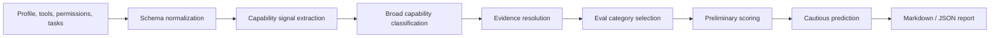
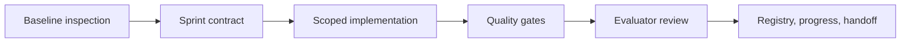

# Architecture

This document explains architecture boundaries and flows. It is not line-by-line
code commentary; use [CODEMAP.md](CODEMAP.md) and source files for detailed
navigation.

Contract2Agent is organized around a deterministic evaluation pipeline plus
specialized adapters that add observed evidence when a family needs deeper
runtime evaluation.

## Core Flow

## Package Boundaries

| Boundary | Responsibility | Must Preserve |
| --- | --- | --- |
| `contract2agent/cli.py` | Public `c2a` CLI and legacy `agentdoctor` alias dispatch. | Script compatibility, clean errors, Typer plus argparse fallback where present. |
| Legacy contract modules | Contract schemas, requirement parsing, scaffold generation, trace checking, counterexamples, diagnosis, diagnostic modes, capabilities, and baselines. | Existing contract diagnosis behavior unless a sprint contract changes it. |
| `contract2agent/evaluation/` | Generalized agent profile evaluation, evidence, scoring, prediction, benchmark/reference context, and reports. | Declared, inferred, observed, reference, prediction, and missing evidence separation. |
| `contract2agent/evaluation/file_reading/` | Local file-reading eval corpus/task/run/grade/report/reference/judge adapter. | Deterministic default grading, corpus boundaries, forbidden-file handling, key redaction, and no fake observed score. |
| `contract2agent/triage/` | Static intake, risk, coverage, readiness, and next-mode recommendations. | No live agent execution or external calls. |
| `contract2agent/cost_estimate/` | Static time/cost estimate from configuration, triage, baselines, and rules. | Estimate-only behavior; no test execution or API calls. |
| `contract2agent/patch_preview/` | Preview-only patch proposal reports and diffs. | No direct application of patches unless a future contract and tests explicitly add that behavior. |
| `docs/` | MkDocs content, static demos, static data, repository docs, and harness state. | Static GitHub Pages behavior and evidence discipline. |
| `scripts/harness/` | Validation and codemap helper scripts. | Call existing commands; do not become a second product runtime. |

## CLI Flow

1. `pyproject.toml` maps `c2a` and the legacy `agentdoctor` alias to `contract2agent.cli:main`.
2. `main()` normalizes selected legacy options and dispatches to the Typer app when available.
3. The Typer app registers the `file-eval` command group and top-level commands.
4. If Typer is unavailable, the argparse fallback registers the same broad command families.
5. Command handlers call package functions and write only the requested reports, scaffolds, traces, or run artifacts.

Public command families are mapped in [CODEMAP.md](CODEMAP.md). CLI docs should
show commands as workflows, keep output modes script-friendly, and avoid implying
that static estimates or previews perform live execution.

## Evaluation Flow

General agent evaluation:

1. Load an agent profile and optional experiment results or benchmark references.
2. Normalize tools, permissions, autonomy, sample tasks, and policies into schema objects.
3. Classify broad agent families from non-name signals.
4. Resolve observed, imported, declared-only, contextual reference, and missing evidence.
5. Compute preliminary score dimensions and confidence.
6. Render JSON or Markdown with limitations and next-eval recommendations.

File-reading evaluation:

1. Import or validate an approved corpus manifest.
2. Load or build task JSONL.
3. Run a black-box target command only through the local CLI runner when requested.
4. Grade deterministically by default.
5. Optionally run a command or LLM judge only when explicitly enabled and budgeted.
6. Compare references only when task pack, scoring method, environment, and conditions are compatible.
7. Render reports that separate deterministic scores from optional judge supplements.

## Harness Flow

The harness is documentation and workflow infrastructure. It does not change
product behavior by itself. It records evidence and helps future agents avoid
unbounded refactors or unsupported verification claims.

## Persistence And Artifacts

- CLI reports and runtime artifacts may be written under command-specific output directories such as `.agentdoctor/`, `reports/`, `.runs/`, or user-specified paths.
- Test temp files use isolated temporary roots such as `.tmp_pytest_base/`.
- MkDocs writes `site/` when the docs build is run.
- File-reading run directories contain task inputs, target outputs, grades, optional judge reports, and rendered reports.
- Static demo assets and metadata live under `docs/agent-eval/`, `docs/playground/`, `docs/assets/`, and `docs/data/`.

Generated caches, runtime artifacts, local reports, secrets, and virtual
environments are not source of truth and should not be committed unless they are
intentional fixtures under `examples/` or `tests/fixtures/`.

## Risky Boundaries

Future agents should not casually change:

- Path containment and safe target selection.
- Secret filtering, API-key handling, and report sanitization.
- Generated-artifact exclusions.
- Static GitHub Pages constraints.
- `agentdoctor` legacy compatibility paths and alias behavior.
- Evidence semantics in scoring, prediction, feature registry, and reports.
- File-reading corpus and forbidden-file boundaries.
- Preview-only patch behavior and auto-mode safety controls.
