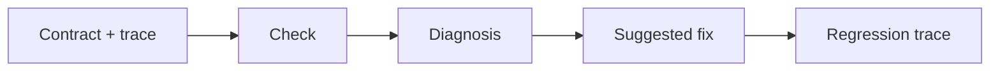

# Contract2Agent

<div class="ad-home">
  <section class="ad-hero">
    <p class="ad-kicker">Offline trace diagnostics for LLM agents</p>
    <h1>Diagnose agent failures from traces.</h1>
    <p class="ad-hero__lead">Contract2Agent turns raw execution traces into clear explanations, rule coverage, repair suggestions, and regression cases.</p>
  </section>
</div>

[Try the Playground](playground/index.html){ .md-button .md-button--primary }
[Read the Quickstart](getting-started.md){ .md-button }
[View Diagnosis Categories](failure-taxonomy.md){ .md-button }

## Why Use It

Agent failures are rarely just pass or fail. A trace can show that a reader tool
returned `file_not_found`, a writer still ran, a forbidden search happened, or
an eval rejected an output variant that the task should allow.

Contract2Agent keeps that evidence visible and turns it into a reviewable next
step.

<div class="ad-feature-grid">
  <article class="ad-feature-card">
    <strong>Trace Diagnosis</strong>
    <span>Find the tool call, result, or output step that explains the failure.</span>
  </article>
  <article class="ad-feature-card">
    <strong>Strictness Detection</strong>
    <span>Separate too-loose behavior rules from too-strict contracts or checkers.</span>
  </article>
  <article class="ad-feature-card">
    <strong>Rule Coverage</strong>
    <span>See which rules have positive or negative trace evidence.</span>
  </article>
  <article class="ad-feature-card">
    <strong>Patch Suggestions</strong>
    <span>Review suggested contract, checker, prompt, or eval changes before editing.</span>
  </article>
  <article class="ad-feature-card">
    <strong>Regression Traces</strong>
    <span>Capture small traces that reproduce the behavior gap.</span>
  </article>
  <article class="ad-feature-card">
    <strong>Offline CLI</strong>
    <span>Run local checks without adding a backend, analytics, or an LLM API call.</span>
  </article>
</div>

## Example Flow



## Small Example

```text
ATD001 [error]
Category: contract_too_loose
Strictness: too_loose
Affected part: error_handling

Cause:
pdf_reader returned file_not_found, but markdown_writer was still called.

Suggested fix:
Add a rule forbidding markdown_writer after pdf_reader returns file_not_found.
```

## Start Here

- New to the project: read [Getting Started](getting-started.md).
- Want to try the diagnosis model quickly: open the [Playground](playground/index.html).
- Need exact commands and flags: use the [CLI Reference](cli.md).
- Reviewing categories: see [Failure Taxonomy](failure-taxonomy.md).

## Current Scope

Contract2Agent is lightweight and static-first. The playground is a browser-side
preview, while full diagnosis, reports, patch previews, baselines, and
regression trace writing run through the local CLI.
